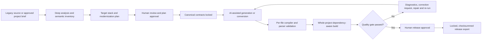
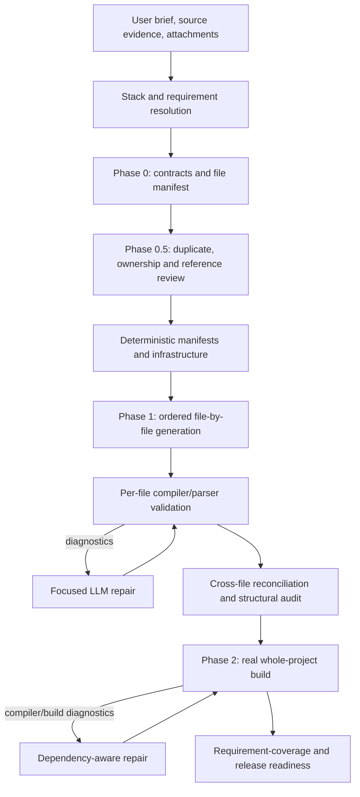
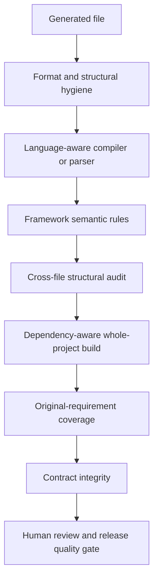
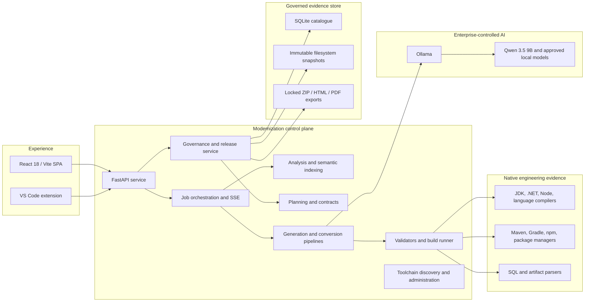

# StratIQ Modernization Studio

## From legacy complexity to governed, build-validated software

**Client presentation and solution overview**  
**Prepared from the implemented Modernization module**  
**Document date: 29 July 2026**

---

## Executive message

Application modernization has traditionally forced enterprises to choose between two imperfect approaches:

1. slow, expensive manual transformation programs that struggle to scale; or
2. fast generative-AI experiments that produce impressive snippets but insufficient evidence that a complete application compiles, preserves its contracts, or is safe to release.

StratIQ Modernization Studio closes that gap.

It is an on-premises, AI-assisted modernization control plane that combines:

- deep legacy estate analysis;
- prompt-driven greenfield and transformation journeys;
- contract-first solution planning;
- local open-source code models through Ollama;
- deterministic project, infrastructure, and deployment scaffolding;
- compiler-, parser-, and whole-project build validation;
- automated repair using real diagnostic feedback;
- immutable snapshots, human approvals, comparison, audit evidence, and release gates.

The result is not simply generated code. It is a governed modernization package with traceable requirements, architecture decisions, canonical contracts, generated artifacts, validation results, review history, and a locked export.

> **The core proposition:** use AI for the work that requires interpretation and synthesis, and use deterministic engineering systems for the work that must be exact.

This changes the economics of modernization because the platform moves engineering effort away from repetitive discovery, translation, scaffolding, and first-pass remediation—and toward the decisions that genuinely require enterprise context: business-rule confirmation, target architecture, risk ownership, testing strategy, cutover, and release approval.

---

## The client problem we address

Modernization programs rarely fail because teams cannot write a new controller or convert a class. They fail because the transformation spans too many interconnected concerns:

- the real application scope is not understood;
- business rules are embedded in old code, SQL, configuration, batch jobs, and operational conventions;
- interfaces and data contracts drift during conversion;
- target architecture decisions are made inconsistently across teams;
- generated or manually translated components do not compile together;
- deployment manifests disagree with application configuration;
- testing and observability arrive too late;
- reviewers cannot trace an output back to its source, prompt, plan, model, or validation evidence;
- programs scale headcount faster than they scale delivery.

Generic LLM chat can accelerate an individual developer, but it does not by itself solve these program-level issues. Modernization needs a system of work around the model.

StratIQ provides that system.

---

## What the platform is

StratIQ Modernization Studio is a unified workspace for four connected activities:

1. **Discover** – analyze an existing source estate and identify technologies, architecture, dependencies, database usage, anti-patterns, business domains, and modernization targets.
2. **Design** – transform evidence or a project brief into an explicit plan, target architecture, canonical contracts, assumptions, risks, exclusions, and release criteria.
3. **Transform** – generate or convert code through a contract-aware local LLM pipeline, with deterministic scaffolding for build and deployment artifacts.
4. **Govern and release** – validate, compare, review, approve, lock, and export modernization outputs with a durable audit trail.

The module supports both:

- **modernize-existing journeys**, where a folder or uploaded codebase is analyzed and transformed; and
- **prompt-to-project journeys**, where a governed project is created from an approved brief and generated as a complete application.

It also supports a focused **single-file mode** for genuinely standalone artifacts. If a request describes a distributed application that cannot truthfully fit into one file, the service promotes it to full-project generation instead of silently truncating the architecture.

---

## A client-visible modernization journey



This workflow makes AI generation one controlled stage in a broader engineering lifecycle. The model cannot approve its own architecture, waive a failed compiler result, or mark an incomplete project production-ready.

---

# 1. Capabilities and functionality

## 1.1 Governed Projects

The Governed Projects workspace manages modernization as a lifecycle rather than a one-time generation request.

Implemented states include:

- Uploaded
- Analyzed
- Plan Generated
- Plan Reviewed
- Plan Approved
- Transformation Running
- Validation Running
- Review Required
- Approved
- Exported

### Project creation

A project can begin from:

- an existing source directory;
- an uploaded folder;
- a prompt or approved business/technical brief;
- an engine-native target preset;
- a guided preset;
- a custom target stack.

Prompt-created projects are treated as governed greenfield projects. The prompt itself becomes the immutable source brief. The platform infers explicitly stated architecture, runtime, database, security, roles, and deployment requirements, while keeping assumptions visible.

### Planning and review

The plan captures:

- current-state evidence;
- target architecture and technologies;
- modules and domains;
- transformation sequence;
- excluded modules;
- database conversion approach;
- interfaces and dependencies affected;
- security and configuration changes;
- testing and release gates;
- deployment approach;
- cutover and rollback decisions;
- risks, assumptions, unsupported constructs, and manual tasks.

For prompt-based greenfield work, the platform applies secure, sensible defaults where the brief is silent and records them as assumptions. It does not incorrectly block project generation on release-management decisions such as cutover timing or RPO/RTO. For existing-system transformations, those operational decisions remain explicit owner tasks.

Plans can be revised without overwriting history. Review and approval are separate actions. Approved plans are locked.

### Canonical contracts

The platform creates and governs contracts for:

- domain models;
- DTOs;
- interfaces;
- API routes;
- database access and schemas;
- events and messages;
- error models;
- authentication;
- configuration;
- namespace/package ownership.

Contract validation checks duplicate types and conflicting routes and records areas that still require implementation-level evaluation.

### Snapshots and audit history

Every significant artifact is versioned as an immutable snapshot:

- source;
- analysis;
- plans;
- contracts;
- generated outputs;
- validation;
- approvals;
- exports;
- overrides and review decisions.

Each snapshot carries:

- a version;
- a parent relationship;
- a SHA-256 tree checksum;
- creation time and actor;
- target-stack metadata;
- model metadata;
- prompt-template version;
- status and approval decision.

The catalogue uses SQLite and the snapshot payloads use local filesystem storage. It is intentionally Git-independent, allowing governance to operate in isolated or on-premises environments while remaining compatible with downstream Git workflows.

### Comparison and review

Reviewers can:

- compare two output or release snapshots;
- see added, modified, and removed files;
- inspect unified diffs;
- classify changes;
- search or filter change sets;
- export comparisons as HTML or PDF;
- approve or reject individual files;
- submit correction feedback;
- trigger a correction run;
- restore an earlier snapshot as a new version.

### Retention and deletion

Retention policies purge eligible unlocked snapshots while preserving locked evidence.

Project deletion is an administrator-only operation. Data is first quarantined, catalogue deletion is transactional, and the system attempts restoration if deletion fails. This provides safer lifecycle management than a direct destructive filesystem operation.

---

## 1.2 Quick Analysis

Quick Analysis provides a faster path for assessment and transformation.

Users can:

- browse to a local source folder;
- upload a folder from their workstation;
- enter a natural-language project prompt;
- attach reference documents, source files, structured data, or screenshots;
- choose full-project or single-file output;
- add target-stack guidance;
- launch analysis or generation.

The UI supports reference material including PDF, Word, Markdown, text, CSV, JSON, YAML, XML, SQL, Java, C#, Python, JavaScript, TypeScript, shell, PowerShell, and images.

### Deep source analysis

The analyzer inventories:

- language distribution;
- framework and technology signatures;
- line and symbol metrics;
- namespaces and packages;
- database connections, tables, entities, SQL, and stored procedures;
- architecture pattern and application era;
- tier and complexity indicators;
- anti-patterns;
- inferred business domains;
- source-file index;
- IBM i-specific constructs where applicable.

The governed semantic index goes deeper into:

- module and package hierarchy;
- symbols, classes, interfaces, functions, and methods;
- call relationships;
- module and package dependencies;
- API endpoints;
- database access;
- authentication and authorization;
- configuration;
- scheduled jobs;
- external integrations;
- test-to-code mapping;
- dead-code candidates;
- cyclic dependencies.

This creates a reusable fact base for planning, contract generation, and transformation.

---

## 1.3 Transformation Jobs

Transformation jobs provide operational visibility for long-running work.

The job experience includes:

- current phase and percentage;
- real-time Server-Sent Events;
- polling resilience;
- event log;
- detected technology stack;
- architecture information;
- database findings;
- anti-pattern findings;
- generated output;
- per-file validation diagnostics;
- whole-project build result;
- downloadable artifact.

Terminal states are deliberately distinct:

- completed;
- validation failed;
- failed.

If generation returns useful source that does not pass strict validation, the source is retained for diagnosis but is explicitly marked review-only. Downloads include the validation report and generation audit. A failed project is not presented as production-ready.

---

## 1.4 Target-stack and toolchain catalogue

The current implementation declares:

- **59 engine-native presets**
- **34 additional guided presets**
- **93 total declared target presets**
- **45 normalized language or artifact labels**

The catalogue spans:

- Java/Spring Boot, Quarkus, and Micronaut;
- .NET MVC, Blazor, React, Angular, and microservices;
- Node.js, NestJS, Express, Next.js, React, Vue, and Angular;
- Python FastAPI and Django;
- Go, Rust, PHP, Ruby, Kotlin, Scala, Clojure, Swift, Dart, Elixir, Erlang, Haskell, Julia, R, C, and C++;
- COBOL, IBM i, PL/I, RPG, JCL, Fortran, Ada, Pascal/Delphi, OCaml, Prolog, MUMPS, Natural, OpenEdge, ABAP, and Apex journeys;
- SQL, PL/SQL, T-SQL, DB2, PostgreSQL, MySQL, and database migration targets;
- Protobuf, GraphQL, JSON, YAML, XML, TOML, Markdown, Dockerfile, Terraform, CloudFormation, Kubernetes, Helm, Ansible, Jenkins, and GitHub Actions artifacts.

This number must be interpreted honestly: **the catalogue is not a claim that every target is production-build-ready on every host.** Availability is calculated dynamically from installed validators, compilers, build tools, and platform prerequisites.

The platform distinguishes:

- compiler/parser-backed validation;
- dependency-aware full-project generation;
- artifact validation;
- vendor-platform structural heuristics;
- missing or externally gated prerequisites.

This avoids the common “supported” label that hides an unavailable compiler or an untestable target.

The Admin Console exposes toolchain readiness and installation workflows for major SDKs and compilers, including Java, .NET, Node, Python, Go, PHP, Ruby, LLVM, Protobuf, Rust, Swift, Kotlin, R, Haskell, Julia, Dart, Ada, Pascal, Erlang, OCaml, Prolog, and Common Lisp.

---

# 2. How open-source LLMs are used

## 2.1 Local inference by design

The Modernization module integrates with Ollama over a local HTTP endpoint. On the current host, the active and recommended code-generation model is:

**Qwen 3.5 9B (`qwen3.5:9b`)**

The current local Ollama inventory also includes Llama 3.1 8B and Qwen 2.5 Coder 7B. The service has an ordered set of approved fallback models, including larger Qwen coder variants, DeepSeek Coder, Code Llama, and Mistral where installed.

The 9B default is intentional for the shared infrastructure:

- it fits the available 12 GB GPU profile;
- it avoids routine CPU offload;
- it provides a favorable latency/quality balance;
- it enables repeated, private modernization calls without per-token cloud charges;
- it supports predictable operations on enterprise-controlled infrastructure.

The model endpoint, installed models, and active choice are visible through platform health/status capabilities.

## 2.2 The model is a reasoning component—not the control plane

The platform does not ask the LLM to generate an entire application in one unconstrained response.

Instead, the model operates within a staged protocol:



### Phase 0 – contract and manifest synthesis

The model defines:

- shared types and their canonical locations;
- service/repository operations;
- external interfaces;
- data contracts;
- cross-cutting concerns;
- configuration shapes and keys;
- location taxonomy;
- symbol ownership;
- complete file manifest.

This contract-first step reduces the chance that independently generated files invent different DTOs, endpoint paths, method signatures, or configuration shapes.

### Phase 0.5 – design review before code

A second model task reviews the contract document for:

- duplicate or near-duplicate types;
- parallel folder structures;
- redundant components;
- route conflicts;
- unreferenced files;
- missing ownership;
- dangling references;
- ambiguous namespace/package entries.

The corrected contract becomes the authority for generation.

### Phase 1 – ordered, file-by-file generation

Files are generated in dependency-aware order:

1. entities, domain models, and DTOs;
2. dependency manifests;
3. repositories and services;
4. controllers, components, and composition roots;
5. remaining implementation;
6. tests.

Every call receives the relevant:

- user requirement;
- stack profile;
- contract;
- namespace/package map;
- file manifest;
- already generated dependency manifest;
- digest of related files;
- hard acceptance criteria;
- reference guide.

This is far more controlled than repeatedly asking a model to “remember” the shape of a growing project.

### Phase 2 – real build and repair

After generation, the platform materializes the whole project and runs the registered build route—for example:

- Maven or Gradle for Java;
- .NET build for C#;
- npm/TypeScript/Vite builds for web projects;
- language-specific package, compile, parser, or test routes for supported stacks.

Compiler messages are attributed to source files. Missing symbols, methods, constructors, types, packages, and provider locations are extracted and used to select related files for the repair context.

The LLM fixes the failing file against:

- the authoritative contracts;
- the namespace map;
- the actual compiler diagnostics;
- related provider source;
- the list of available local files.

The build is repeated. The acceptance decision is made by the build result, not by the confidence of the model response.

---

## 2.3 Stack-specific prompting

A single universal prompt is not sufficient across modern and legacy technologies. The platform composes a stack-neutral core with language, framework, and datastore profiles.

This matters because:

- COBOL uses divisions, copybooks, file status, and fixed/free source rules;
- DB2 uses host variables, cursors, SQLCODE, and platform dialect rules;
- React requires hook, render, and state discipline rather than controller patterns;
- Spring Boot 3 requires Jakarta namespaces and current security semantics;
- SQL engines differ in routine, exception, parameter, and DDL syntax;
- non-relational data needs partition and consistency design, not relational assumptions.

The core prompt enforces:

- immutable contract truth;
- exact cross-boundary consistency;
- API honesty;
- dependency discipline;
- complete implementations;
- secure configuration;
- canonical ownership;
- no placeholders or duplicate logic.

Then the stack profile translates those invariants into the correct language mechanisms.

---

## 2.4 Performance and resource optimization

The LLM integration includes several efficiency controls:

- **GPU-fit default model** – Qwen 3.5 9B is selected to remain within the host GPU profile.
- **Low-temperature generation** – the service uses a low temperature for repeatable code generation.
- **Adaptive context windows** – smaller files receive smaller contexts, reducing KV-cache overhead.
- **Adaptive output budgets** – token budgets vary by file type and source size.
- **File prioritization** – contracts and providers are generated before consumers.
- **Content-addressed conversion cache** – unchanged source can bypass repeated model conversion.
- **Parallel source conversion** – bounded worker pools overlap local model queueing and file processing.
- **Focused repairs** – the repair prompt contains actual diagnostics and related files rather than the entire repository.
- **Deterministic assets** – the LLM does not spend tokens recreating stable build, compose, Kubernetes, or framework boilerplate where exact generation is safer.
- **Partial-result persistence** – generated files can be saved as they arrive, reducing loss from long-running interruptions.
- **Streaming progress** – users see live job movement instead of waiting on an opaque request.

These controls make a modest local model materially more useful than its raw benchmark score would suggest.

---

# 3. Deterministic engineering controls

## 3.1 Why deterministic scaffolding matters

Some artifacts benefit from creativity; others require exact internal consistency.

The platform therefore owns deterministic generation for selected:

- dependency manifests;
- frontend bootstrap;
- Dockerfiles;
- Docker Compose;
- Kubernetes Deployment, Service, Ingress, ConfigMap, and secret examples;
- framework roots;
- database migration scaffolding;
- selected governed reference packs.

This prevents recurring LLM defects such as:

- a Docker build context that does not contain the referenced file;
- a Kubernetes `targetPort` that disagrees with the container;
- selectors and labels that do not match;
- configuration keys that differ between app and deployment;
- invalid multi-module Maven paths;
- incompatible package versions;
- missing frontend dependencies.

The LLM still authors business-specific implementation. The platform authors the stable structure around it.

## 3.2 Java/Spring Boot hardening

The Java generation service currently enforces:

- a canonical single-module Maven boundary for governed Spring Boot projects;
- Java-version-aware POM generation;
- Spring Boot 3 dependencies and test tooling;
- deterministic dependency inference from generated imports;
- flattening of invalid pseudo-module source roots;
- public Java type/filename alignment;
- migration from legacy Java EE `javax.*` imports to `jakarta.*`;
- project-local type ownership and import reconciliation;
- frontend dependency closure for Java full-stack projects;
- creation of missing local stylesheet assets;
- explicit `Idempotency-Key` controller parameters;
- constructor injection;
- dedicated DTO ownership;
- rejection of obsolete `WebSecurityConfigurerAdapter`;
- Bean Validation contract checks;
- requirement coverage for REST, PostgreSQL, Flyway, Kafka, idempotency, security, roles, observability, transactions, retries, tests, containers, Kubernetes, and CI.

The strict acceptance route is a real `mvn verify`, optionally combined with an npm production build. It does not mark a Java project ready because individual files merely look plausible.

## 3.3 Validation layers



### Layer 1 – hygiene

Rejects or repairs:

- markdown fences;
- empty content;
- placeholders and TODO-only implementations;
- malformed delimiters;
- invalid generic artifacts.

### Layer 2 – real compiler/parser

Where available, the platform invokes actual language tools. Examples include:

- Java `javac`;
- .NET Roslyn;
- TypeScript compiler;
- Python compilation;
- SQL parsers and linting;
- JSON, YAML, XML, TOML, GraphQL, HCL, and Protobuf validation;
- external compiler routes for supported native and functional languages.

### Layer 3 – framework semantics

Rules catch code that may parse but is invalid for the selected modern framework—for example Spring Boot 3 namespace, injection, controller, DTO, security, and error-handling violations.

### Layer 4 – whole-project acceptance

The real build validates dependency resolution and cross-file contracts. For a full-stack Java/React application, both Maven and npm must pass, producing a combined `maven+npm-build` result.

### Layer 5 – requirement coverage

The platform checks that requested capabilities have concrete artifacts and implementation evidence. A dependency name in a POM is not sufficient if the prompt required a controller contract, publisher, migration, or test suite.

### Layer 6 – release gate

Release approval is blocked when:

- production readiness is false;
- no files were checked;
- no strict compiler/parser ran;
- any file validation failed;
- the required whole-project build did not run or did not pass;
- canonical contracts are invalid;
- the generation audit reports unresolved issues.

Only a passed output can be approved and exported as a locked release.

---

# 4. Technical architecture

## 4.1 Logical architecture



## 4.2 Component view

| Component | Responsibility |
|---|---|
| React/Vite frontend | Governed Projects, Quick Analysis, jobs, output, diagnostics, comparison, review, approvals, release export, administration |
| FastAPI API | Authenticated APIs, upload/browse, projects, jobs, SSE, downloads, LLM/toolchain status, SPA hosting |
| Analyzer | Language/technology detection, metrics, architecture, database, anti-pattern, domain, IBM i analysis |
| Governance service | Project lifecycle, SQLite catalogue, immutable snapshots, checksums, review, retention, restore, compare, approve, export |
| Prompt pipeline | Brief-to-project planning, contracts, manifest validation, per-file generation, requirement coverage |
| Conversion pipeline | Existing-source conversion, target-specific hints, caching, parallelism, preservation of business logic |
| Deterministic build artifacts | Framework manifests, dependency closure, Docker, Compose, Kubernetes, frontend bootstrap |
| Validation orchestration | Per-file compiler/parser feedback, bounded repair loop, framework semantics |
| Build runner | Materialization, dependency-aware builds, error attribution, combined backend/frontend acceptance |
| Ollama integration | Local model discovery, selection, streaming generation, retries, reasoning control |
| Toolchain service | Detects host readiness and supports controlled installation workflows |

## 4.3 Data and security architecture

The current module is designed for an enterprise-controlled host:

- source, prompts, generated code, and snapshots remain in the deployment environment;
- LLM inference is local through Ollama;
- governance storage has no mandatory cloud or external database dependency;
- filesystem access can be constrained to a configured root;
- authentication is required by default;
- non-default token secrets are required in secured operation;
- administrator role checks protect sensitive actions;
- CORS origins are configurable;
- release checksums provide artifact integrity evidence.

OpenAI also offers strong enterprise privacy controls; the distinction is not that OpenAI automatically trains on business API data—it does not by default. The distinction is that local Ollama inference can keep the full source-processing path inside the customer-operated boundary without sending prompts or source to a third-party inference service.

---

# 5. What is different from using an OpenAI LLM directly?

## 5.1 A fair comparison

OpenAI offers frontier reasoning and coding models, very large context windows, multimodal input, tools, structured outputs, enterprise security, data residency options, and formal evaluation APIs. Its business/API data is not used for model training by default, and qualifying organizations can pursue additional retention controls.

Those are substantial strengths.

StratIQ’s differentiation should therefore not be presented as “OpenAI is only a chatbot” or “cloud AI is inherently insecure.” The credible comparison is:

> **OpenAI provides highly capable general-purpose intelligence. StratIQ provides a specialized modernization operating system that can run with enterprise-controlled open-source intelligence.**

## 5.2 Comparative view

| Dimension | StratIQ Modernization Studio with local open-source LLM | Direct use of an OpenAI model/API |
|---|---|---|
| Primary product | End-to-end modernization workflow | General-purpose model and agent platform |
| Model capability | Efficient local coder model optimized by workflow and tools | Frontier reasoning/coding models; typically stronger on the hardest unconstrained tasks |
| Deployment boundary | Local/on-premises Ollama inference | OpenAI-managed API infrastructure with enterprise controls and regional options |
| Source-code movement | Can remain entirely within customer-operated infrastructure | Source is transmitted to the API under configured data controls |
| Cost model | Infrastructure/capacity-led; no per-token inference charge from a third-party API | Usage- or capacity-priced API consumption |
| Offline/isolated operation | Possible when dependencies/toolchains are locally available | Requires service connectivity |
| Modernization analysis | Built-in legacy analysis, semantic index, database and anti-pattern inventory | Must be designed and implemented by the customer/integrator |
| Contract-first generation | Native Phase 0/0.5 contract and manifest workflow | Can be implemented using prompts, tools, and application logic |
| Deterministic scaffolding | Built into target-specific generation services | Must be supplied by the surrounding application |
| Compiler/build feedback | Native per-file and whole-project gates with repair | Model can use tools, but the build loop must be engineered and governed |
| Toolchain readiness | Dynamic host/toolchain catalogue and fail-closed target availability | Not a native modernization concern |
| Governance | Immutable snapshots, review, approval, compare, retention, release locks | OpenAI provides platform governance; modernization artifact governance must be built around it |
| Release decision | Model cannot override failed validation; human approval required | Depends on the consuming application |
| Vendor/model lock-in | Uses approved Ollama-compatible local models | OpenAI model/API dependency |
| Peak reasoning quality | Constrained by selected local model and hardware | Advantage to current frontier models |
| Operational responsibility | Customer operates GPU, model, toolchains, storage, and updates | OpenAI operates model-serving infrastructure |

## 5.3 Where StratIQ can deliver greater business value

StratIQ can outperform a direct-model approach at the **program outcome**, even when a frontier model is stronger at an isolated reasoning benchmark, because the platform supplies the missing controls:

- the complete source estate is inventoried;
- requirements become explicit contracts;
- output ownership is canonical;
- infrastructure is generated consistently;
- real tools judge correctness;
- failures feed a targeted repair loop;
- every run is versioned;
- release evidence is retained;
- humans approve architecture and release.

In other words, the advantage is **system quality**, not a claim of universal model superiority.

## 5.4 Optional strategic positioning

The local-model design creates a strong base for:

- regulated or sovereign deployments;
- sensitive intellectual property;
- high-volume transformation workloads;
- predictable internal capacity;
- customer-specific model evaluation;
- future model substitution without redesigning the modernization lifecycle.

The architecture also establishes a natural path for a future policy-driven hybrid model tier—local models for routine/private work and approved frontier models for selected high-complexity tasks—while keeping the same contracts, build gates, snapshots, and approvals. That hybrid routing is a strategic extension, not a claim about the current implementation.

---

# 6. Business benefits

## 6.1 Faster discovery

Automated language, architecture, database, dependency, endpoint, and anti-pattern analysis compresses the initial understanding cycle.

**Business effect:** teams can start planning from a shared evidence base instead of spending early project phases reconciling spreadsheets and interviews.

## 6.2 Higher engineering throughput

The platform automates repetitive work:

- code inventory;
- first-pass target mapping;
- contract drafting;
- file planning;
- source translation;
- boilerplate;
- tests and deployment assets;
- compilation diagnosis;
- routine repair.

**Business effect:** senior engineers spend more time on business semantics, architecture, exceptions, performance, integration, and migration risk.

## 6.3 Reduced rework

Contract-first generation and compiler-driven repair expose inconsistencies earlier.

**Business effect:** fewer downstream cycles caused by mismatched DTOs, methods, routes, packages, schemas, ports, or dependency manifests.

## 6.4 Better governance without slowing delivery

Plans, contracts, outputs, validation, reviews, and releases are connected through immutable snapshots.

**Business effect:** governance becomes part of delivery rather than a manual documentation exercise after delivery.

## 6.5 Lower external inference dependency

Local open-source inference avoids routine third-party per-token charges and can keep sensitive code inside the customer environment.

**Business effect:** predictable internal capacity for large modernization portfolios and clearer control over the source-processing boundary.

This does not mean local inference is free. The customer must account for GPU/CPU infrastructure, energy, model operations, support, patching, and engineering ownership.

## 6.6 Improved auditability

Checksums, actors, model metadata, prompt-template versions, parent snapshots, decisions, and locked releases create a chain of evidence.

**Business effect:** reviewers can answer what changed, why it changed, which model and plan were used, what passed, who approved it, and what was exported.

## 6.7 Safer modernization at scale

Dynamic target readiness prevents a team from selecting a “supported” stack when the deployment host lacks the required compiler or build adapter.

**Business effect:** feasibility constraints become visible before expensive generation work begins.

---

# 7. Efficiency, effectiveness, and optimization model

## Efficient

The platform reduces unnecessary work through:

- local GPU-resident inference;
- adaptive context and output budgets;
- content-addressed caching;
- parallel conversion;
- deterministic scaffolding;
- targeted diagnostic repair;
- incremental snapshots;
- automatic requirement extraction.

## Effective

The platform improves output relevance through:

- source evidence;
- target-specific conversion hints;
- canonical contracts;
- stack profiles;
- reference guides;
- provider/consumer context;
- original-requirement coverage.

## Optimized

The platform improves the overall modernization system through:

- compiler and build acceptance;
- toolchain-aware routing;
- release-quality gates;
- correction loops;
- human approval;
- traceable outcomes.

The combination matters. A fast generator that creates rework is not efficient. A correct file that does not fit the project is not effective. A technically good build without governance is not an optimized enterprise modernization process.

---

# 8. Value measurement for a client pilot

The platform should be evaluated against an agreed baseline, not through unsupported universal percentage claims.

## Recommended KPIs

| KPI | Definition | Why it matters |
|---|---|---|
| Time to evidence-backed assessment | Elapsed time from source intake to reviewed analysis | Measures discovery acceleration |
| Transformation throughput | Source files, modules, or function points processed per engineering week | Measures scale |
| First strict-build pass rate | Percentage of generated projects passing the first whole-project build | Measures generation quality |
| Repair convergence | Average build/repair rounds to pass or reach review-required state | Measures feedback-loop efficiency |
| Requirement coverage | Percentage of explicit requirements with concrete artifact evidence | Measures completeness |
| Contract drift defects | Cross-boundary defects found after generation | Measures contract effectiveness |
| Reviewer effort | Human hours from generated output to approval | Measures practical productivity |
| Escaped defects | Defects found after release approval | Measures risk reduction |
| Reuse/cache rate | Percentage of unchanged conversion work served from cache | Measures incremental efficiency |
| Cost per transformed module | Infrastructure, model operations, and human effort divided by accepted modules | Measures economics |
| Lead time to approved release | Source/brief intake to locked export | Measures end-to-end value |
| Traceability coverage | Percentage of approved outputs linked to source, plan, contracts, validation, and approver | Measures governance |

## Suggested pilot design

Select:

- one representative application;
- 3–5 modules of varying complexity;
- one database integration;
- one external interface;
- existing tests where available;
- a target stack supported by the installed toolchain;
- a comparable manual or generic-LLM baseline.

Run:

1. source intake and analysis;
2. plan and architecture review;
3. canonical contract approval;
4. transformation;
5. strict build and repair;
6. human review;
7. release-gate evaluation;
8. KPI comparison and lessons learned.

Define success before the pilot starts. A sensible pilot exit criterion is not “the AI produced code”; it is:

- architecture reviewed;
- critical business rules traceable;
- project builds;
- required tests exist and run;
- no unresolved release blockers;
- reviewers judge the output maintainable;
- effort and lead time compare favorably with baseline.

---

# 9. Representative use cases

## Java 8 to Java 21 / Spring Boot 3

The platform can:

- preserve existing business rules;
- replace JDBC and unsafe SQL composition with modern persistence;
- introduce PostgreSQL and Flyway;
- create REST and event contracts;
- implement Kafka and outbox patterns;
- enforce explicit idempotency;
- add OAuth2/JWT;
- add validation and structured errors;
- add tracing, logging, health, and metrics;
- generate tests, Docker, Compose, Kubernetes, and CI;
- compile with Maven and build the frontend.

## .NET modernization

Typical journeys include:

- legacy .NET/Java/Python/TypeScript to ASP.NET Core;
- MVC, Blazor, React, or Angular targets;
- constructor injection and configuration externalization;
- database migration;
- container and Kubernetes enablement;
- Roslyn and full-project build validation.

## Mainframe and IBM i modernization

The analysis and prompt profiles recognize:

- COBOL structure and copybooks;
- DB2 access;
- RPG procedures and subroutines;
- CL flow;
- DDS record formats;
- program calls;
- database/device files;
- fixed-format and compiler-specific constraints.

Vendor-platform outputs that cannot be compiled with an available open-source toolchain are explicitly labeled as heuristic or externally gated. The platform does not misrepresent structural validation as a production compiler result.

## Database and schema modernization

Journeys cover:

- Oracle to PostgreSQL, SQL Server, or MongoDB;
- SQL, PL/SQL, T-SQL, DB2, PostgreSQL, and MySQL artifacts;
- table, entity, connection, query, and stored-procedure inventory;
- dialect-aware generation and validation;
- migration notes and schema artifacts.

## Prompt-to-product acceleration

For an approved product brief, the platform can produce:

- architecture and migration narrative;
- full backend/frontend project;
- persistence and migrations;
- security;
- messaging;
- observability;
- testing layers;
- local orchestration;
- Kubernetes;
- CI;
- validation and release evidence.

---

# 10. Proof points from the current implementation

At the time of this document:

- the local Ollama service is available;
- `qwen3.5:9b` is the active and recommended code model;
- the repository declares 93 native/guided target presets;
- target availability is dynamically gated by host toolchains;
- Java generation uses deterministic Maven topology and dependency closure;
- generated Java/React projects are accepted through a combined `maven+npm-build` route;
- strict validation is fail-closed;
- validation-failed outputs are retained but labeled review-only;
- governed releases require a passed quality gate and human approval;
- approved releases are locked and exported with a manifest and checksum;
- the current automated service suite passes **130 tests and 258 subtests**;
- an expanded Java dependency build and combined Maven/npm production acceptance test passed during the engineering verification preceding this document.

These are engineering proof points, not claims that every possible legacy application will modernize without human work.

---

# 11. What remains human-owned

Responsible positioning is essential. The platform accelerates and controls modernization; it does not eliminate accountability.

Humans remain responsible for:

- confirming business semantics;
- selecting target architecture;
- resolving ambiguous legacy behavior;
- approving data migration and reconciliation;
- performance and capacity testing;
- threat modeling and security assurance;
- licensing and open-source governance;
- accessibility and user acceptance;
- production topology;
- cutover, rollback, RPO, and RTO;
- regulatory approval;
- final release.

The quality gate proves the checks it ran. It does not claim to prove unstated requirements, production traffic behavior, or business acceptance.

---

# 12. Why this can reshape the modernization landscape

The market is moving from “AI that writes code” to “AI systems that deliver controlled engineering outcomes.”

StratIQ is aligned with that shift because it treats modernization as a closed-loop process:

```text
Understand → Decide → Contract → Generate → Compile → Repair → Review → Approve → Evidence
```

This creates five structural advantages:

1. **Sovereign intelligence** – local open-source models can operate inside the enterprise boundary.
2. **Engineering truth** – compilers, parsers, and build tools—not prose—judge technical acceptance.
3. **Program governance** – plans, contracts, outputs, evidence, and approvals remain connected.
4. **Portfolio repeatability** – target profiles, toolchains, scaffolds, and gates can be reused across applications.
5. **Model independence at the workflow layer** – value accumulates in contracts, validators, target packs, evidence, and operating data, not only in one model.

The most important commercial message is:

> **We are not selling token generation. We are industrializing the journey from legacy intent to reviewable, build-validated, governed modern software.**

---

# 13. Recommended client presentation narrative

## Opening

“Most enterprises do not have a shortage of modernization ideas. They have a shortage of repeatable, governed execution. Code can be translated quickly; applications cannot be modernized safely without understanding contracts, data, dependencies, architecture, testing, and release evidence.”

## Tension

“Manual programs provide control but are difficult to scale. Generic AI provides speed but often stops at plausible source. StratIQ combines the strengths of both: local AI for acceleration, deterministic engineering for correctness, and human governance for accountability.”

## Demonstration sequence

1. Create a governed project from source or an approved prompt.
2. Show deep analysis and semantic inventory.
3. Generate and revise the target plan.
4. Review and lock canonical contracts.
5. Run transformation with live progress.
6. Show compiler/build diagnostics and automated repair.
7. Compare output snapshots.
8. Show the release quality gate.
9. Approve and export a locked release.

## Close

“The output is not a code dump. It is a modernization decision package: source evidence, architecture, contracts, generated implementation, build results, review history, and a release artifact. That is how AI moves from developer assistance to enterprise transformation.”

---

# 14. Buyer questions and answers

### Does source code leave the environment?

With the implemented Ollama configuration, model inference is local. Source, prompts, snapshots, and outputs can remain on customer-operated infrastructure. External package registries may still be contacted during dependency restoration unless the deployment uses internal mirrors or pre-populated caches.

### Is the local model better than OpenAI’s frontier models?

Not universally. Current OpenAI frontier models are stronger for many highly complex, unconstrained reasoning tasks. StratIQ’s advantage is the modernization system around the model: evidence, contracts, deterministic assets, compilers, repair, governance, and release controls.

### Can the platform run without internet access?

Local inference and governance can. Strict builds also require all compilers, dependencies, and package artifacts to be locally available through caches or internal repositories.

### Does a passed build mean production is guaranteed?

No. It means the registered compiler/parser/build/contract gates passed. Performance, security assurance, data reconciliation, UAT, and operational acceptance remain required.

### Can clients bring their own target standards?

Yes. The workflow accepts target-stack descriptions and reference guides. The architecture is organized around stack profiles, deterministic scaffolds, target configuration, validators, and build adapters. Client-specific standards should be codified in those governed assets.

### How is model hallucination controlled?

By reducing the model’s authority:

- contracts are explicit;
- symbols have canonical homes;
- dependencies are declared;
- files are generated in order;
- actual compiler errors are fed back;
- deterministic assets are protected;
- failed validation blocks production-ready status;
- humans approve plans and releases.

### How does the platform scale across an estate?

Through repeatable target packs, caching, parallel conversion, toolchain inventories, standardized gates, immutable evidence, and portfolio-level KPI measurement.

---

# 15. Due-diligence notes

Before production adoption, a client should agree:

- deployment and network topology;
- authentication and identity integration;
- secrets and key management;
- source and snapshot storage policy;
- backup and disaster recovery;
- internal package repositories;
- approved open-source models and licenses;
- toolchain versions;
- vulnerability and dependency scanning;
- SAST, DAST, SBOM, and policy gates;
- retention and deletion policy;
- model and prompt evaluation corpus;
- performance baselines;
- human approval roles;
- regulatory obligations.

These controls complement the implemented modernization quality gate.

---

# 16. External reference notes for the OpenAI comparison

The comparison in this document is intentionally balanced and based on current official OpenAI information:

- OpenAI describes its current frontier models as supporting complex reasoning/coding, large context, multimodal input, and the Responses API: [OpenAI model documentation](https://developers.openai.com/api/docs/models).
- OpenAI states that business and API inputs/outputs are not used for model training by default and documents encryption, retention controls, regional options, and enterprise security capabilities: [OpenAI business data privacy](https://openai.com/business-data/).
- OpenAI documents API data retention, Modified Abuse Monitoring, and Zero Data Retention eligibility and behavior: [OpenAI API data controls](https://developers.openai.com/api/docs/guides/your-data#default-usage-policies-by-endpoint).
- OpenAI provides an Evals API for model/application evaluation: [OpenAI Evals API](https://developers.openai.com/api/reference/resources/evals).
- OpenAI provides tool-use capabilities that can be incorporated into custom agent systems: [OpenAI tool-use guide](https://developers.openai.com/api/docs/guides/tools).

OpenAI features, model names, pricing, and policies change over time. Revalidate these facts during procurement or solution design.

---

# 17. Implementation evidence map

For technical due diligence, the principal implementation areas are:

| Area | Repository location |
|---|---|
| API, auth, projects, jobs, SSE, release gates | `Modernization/api/server.py` |
| Governance catalogue and immutable snapshots | `Modernization/services/governance.py` |
| Source analysis | `Modernization/services/analyzer.py` |
| Ollama client, model policy, stack prompts, repair prompt | `Modernization/services/llm.py` |
| Prompt-to-project pipeline | `Modernization/services/modernizer/prompt_pipeline.py` |
| Existing-source conversion | `Modernization/services/modernizer/conversion_pipeline.py` |
| Validation and repair orchestration | `Modernization/services/modernizer/validation_orchestration.py` |
| Compiler/parser routing | `Modernization/services/validators.py` |
| Whole-project build acceptance | `Modernization/services/build_runner.py` |
| Deterministic manifests and deployment assets | `Modernization/services/modernizer/build_artifacts.py` |
| Target stacks and profiles | `Modernization/services/modernizer/target_config.py` |
| Modernization documentation generation | `Modernization/services/modernizer/docs_generation.py` |
| Client workspace | `Modernization/frontend/src/pages` |
| Automated verification | `Modernization/tests` |

---

## Final positioning statement

**StratIQ Modernization Studio converts modernization from an artisanal translation exercise into a governed engineering production line.**

It combines the privacy and economic control of local open-source AI with contract-first design, deterministic project construction, real compiler evidence, automated repair, and enterprise release governance.

The result is faster than purely manual modernization, safer than unconstrained code generation, more transparent than a black-box transformation service, and more repeatable across a portfolio.

**That is the opportunity: not to replace engineering judgment, but to multiply it—while preserving the controls enterprises require.**
